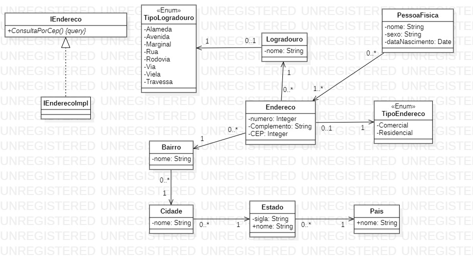

# Tarefa 008 - 29/06/2022

1. Considere o diagrama de classes constante da imagem a seguir:

  

2. Pede-se:
2.1 - Criar um projeto chamado **endereco**:
2.2 - Implementar as classes constantes do diagrama, junto com seus atributos e associações. O Aluno é livre para escolher a linguagem em que fará a implementação. Os exemplos que apresentarei em sala, serão na linguagem Java.
2.3 - Os alunos poderão sugerir melhorias neste projeto, conforme julgarem necessário.
**INSTRUÇÕES**
1. Fazer o _Commit_ deste projeto, no seu repositório pessoal. (Não deverão constar do _commit_ os arquivos de configurações locais, estes devem ser adicionados a um arquivo chamado .gitignore).
2. O Prazo para conclusão desta tarefa é as 22hs do dia 29/06/2022.
3. Este projeto será incrementado à medida que vamos abordando tópicos de aula que se aplicam a ele. Por exemplo outros conceitos de orientação a objetos (herança, polimorfismo), persistência de dados, tratamento de exceção, etc.
